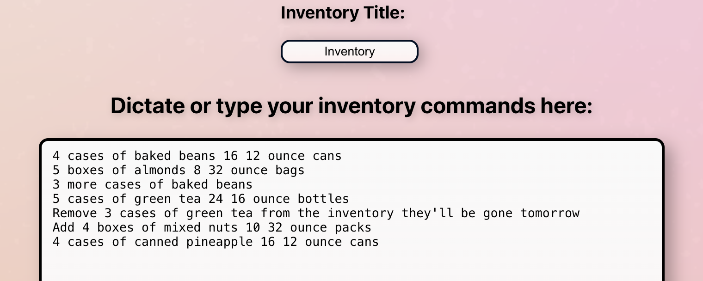
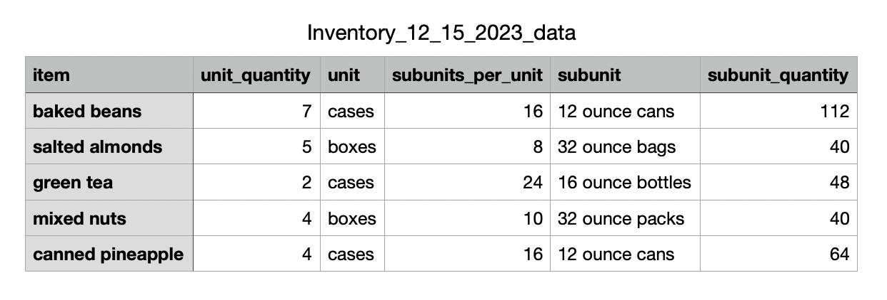

# AI Powered InventoryAssistant

## Your personal assistant when taking inventory. You can talk to it like a human, and it will take your commands and return an inventory spreadsheet back to you, intelligently tracking all your items!

The purpose of this software is to save users time when taking physical inventory of items. The intended use case is dictating text into the text box on one's mobile device. This improves efficiency by allowing the user only to have to visually scan for items, and then quickly move on to the next set of items. Once a user is done giving commands, they press the button "submit commands" which delivers those commands to chatGPT, compiling the commands into a JSON list of inventory items, which then gets converted into a CSV file.

 Below is a visual representation of how data flows through the application: 

# Example use case
Here is an example of a list of commands you could give the application, for taking inventory of food items:

Here is the spreadsheet that is returned to the user:

Note that the application was able to intelligently track previously stated items, and add or subtract units from those items to free up time for the user to keep taking inventory.

# Notes for improvement:
This is by far not a perfect application, just an exploration of a use case for humanizing software using Language Learning Models. Here are some things I hope to work on in the future:

Error checking to ensure that if the user enters non-inventory text, then it will tell the user that that is not what is is supposed to do. 

Exploring different ways inventory can be represented, and accounting for multiple representations in the model. 

Fine-tuning the model in order to allow subunits of items to be added. The model can add main units like "boxes" or "cases," but struggles to add smaller units, like cans within those boxes.

Bigger vision: a much more ambitious goal, but the next evolution of this software I can imagine, is a full mobile app that can dynamically represent the inventory the user is taking. So not submitting one big list of commands, but seeing a spreadsheet or some representation of the inventory happening at each command the user gives. 
